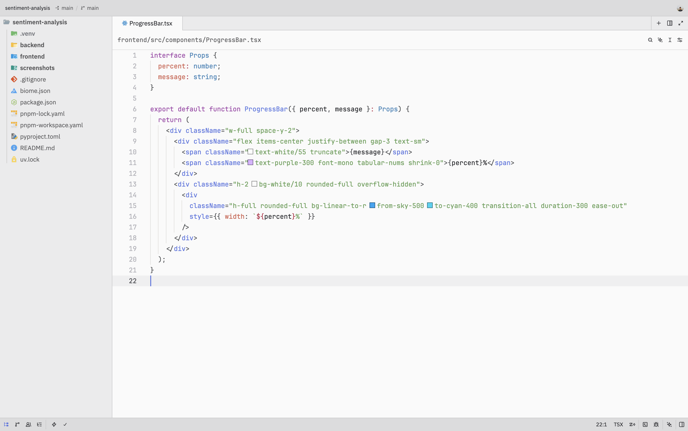

# Vantadark

A theme family that gets out of the way. Two variants — one for each side of the day.

---

## Vantadark

Clean surfaces, minimal yet subtle border lines, five syntax colours. Enough to tell your code apart, not enough to distract you from it.


## Vantabright

The light sibling. JetBrains Islands Light chrome, the same ink palette translated to a clean white editor with a whisper of cool in the panels.



---

## Philosophy

Borders (separator lines) only appear where colour can't do the job alone. Everything else relies on surface depth.

Syntax colours are intentional and minimal:

- **Blue** — functions, constructors
- **Sage green** — strings
- **Amber** — constants, numbers
- **Purple** — keywords
- **Dusty rose** — properties (the "pay attention" colour, used sparingly)

Everything else — variables, punctuation, namespaces — fades into the background. Structural, not semantic.

Five colours is a constraint, not a limitation. When every token is a different colour, your brain stops using colour as signal. We'd rather you read the code.

---

## Install

Open the Command Palette:

**macOS**

```text
cmd + shift + p → extensions → search "Vantadark"
```

**Windows/Linux**

```text
ctrl + shift + p → extensions → search "Vantadark"
```

Or search for **Vantadark** in Zed's extension marketplace.

Configure your theme:

```json
{
  "theme": {
    "mode": "dark",
    "dark": "Vantadark",
    "light": "Vantabright"
  }
}
```

---

## Credits

Inspired by [One Dark Darkened](https://github.com/pavles6/one-dark-darkened) by Pavle Sokic.

---

Made by [Amsh](https://github.com/ams-sth)
