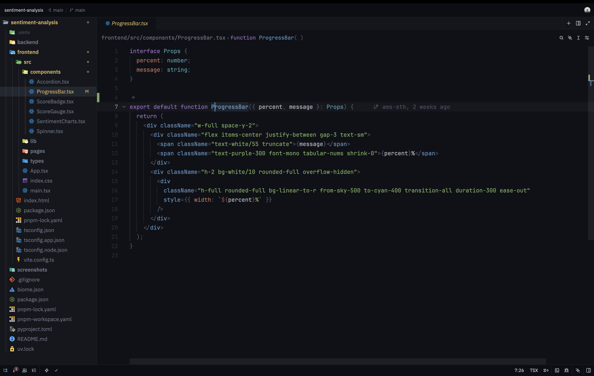

# Vantadark

A dark theme for Zed that gets out of the way. Clean surfaces, no border lines, five syntax colours, enough to tell your code apart, not enough to distract you from it.



## Philosophy

This theme treats borders as optional. Separation comes from surface contrast and spacing instead where each zone (editor, sidebar, tabs, status bar) sits at its own distinct depth. You know where you are without being told.

Syntax colours are intentional and minimal:

- **Blue** - functions, constructors
- **Sage green** - strings
- **Amber** -constants, numbers
- **Purple** - keywords
- **Dusty rose** - properties (the "pay attention" colour, used sparingly)
- Everything else i.e. variables, punctuation, namespaces fades into the background. Structural, not semantic.

## Install

Search for **Vantadark** in Zed's extension marketplace:

```
cmd+shift+p → zed: extensions → search "Vantadark"
```

Or add it directly to your `settings.json`:

```json
{
  "theme": {
    "mode": "dark",
    "dark": "Vantadark"
  }
}
```

## Credits

Inspired by [One Dark Darkened](https://github.com/pavles6/one-dark-darkened) by Pavle Sokic.

---

Made by [Amsh](https://github.com/ams-sth)
